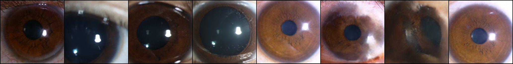

# vq-vae-2
The network for opthalmopgy image generating.

Implementation of Generating Diverse High-Fidelity Images with VQ-VAE-2 in PyTorch

## Requisite

* Python >= 3.6
* PyTorch >= 1.1
* lmdb (for storing extracted codes)

## Usage

Currently supports 256px (top/bottom hierarchical prior)

1. Stage 1 (VQ-VAE)

> python train_vqvae.py [DATASET PATH]

If you use FFHQ, I highly recommends to preprocess images. (resize and convert to jpeg)

2. Extract codes for stage 2 training

> python extract_code.py --ckpt checkpoint/[VQ-VAE CHECKPOINT] --name [LMDB NAME] [DATASET PATH]

3. Stage 2 (PixelSNAIL)

> python train_pixelsnail.py [LMDB NAME]

top:

    python train_pixelsnail.py --hier top --batch 8 [lmdb_dataset]
    
bottom:
    
    python train_pixelsnail.py --hier bottom --batch 8 [lmdb_dataset]
    
sample:

    python sample.py --vqvae checkpoint/vqvae_001.pt --top checkpoint/pixelsnail_top_001.pt --bottom checkpoint/pixelsnail_bottom_001.pt output.png
Maybe it is better to use larger PixelSNAIL model. Currently model size is reduced due to GPU constraints.

## Sample

### Stage 1

Note: This is a training sample

